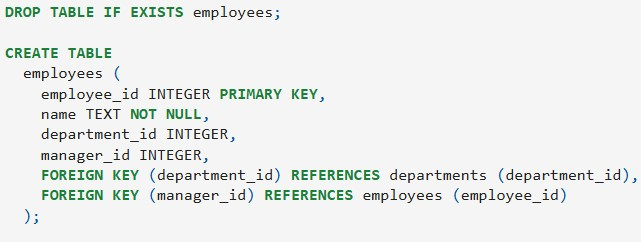
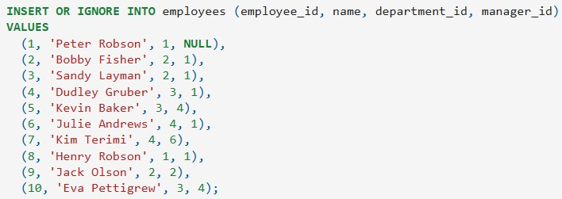
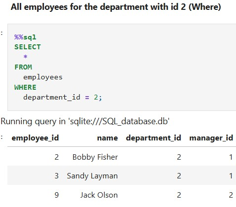
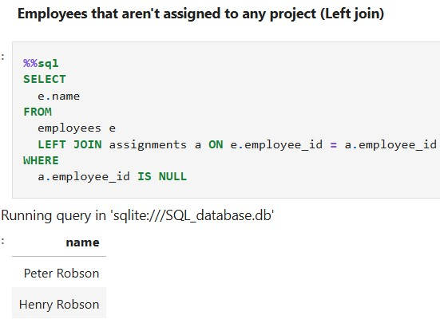
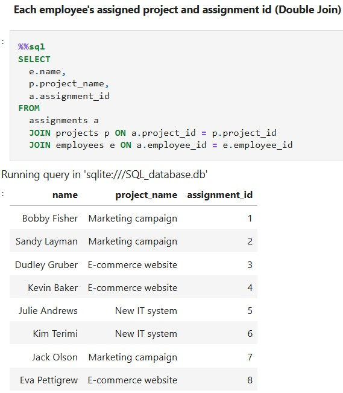
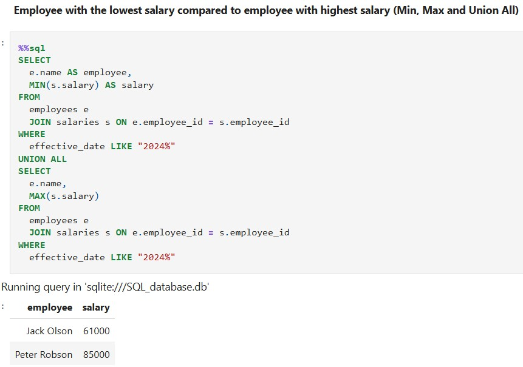
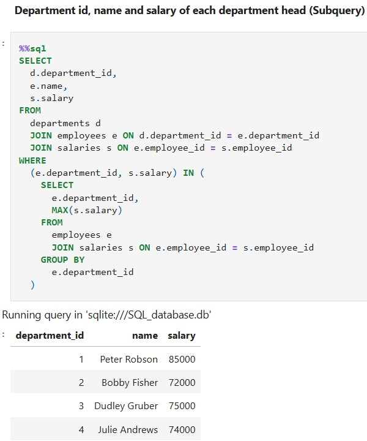
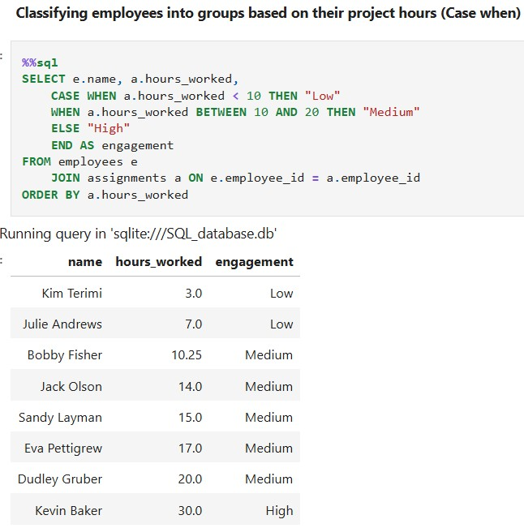
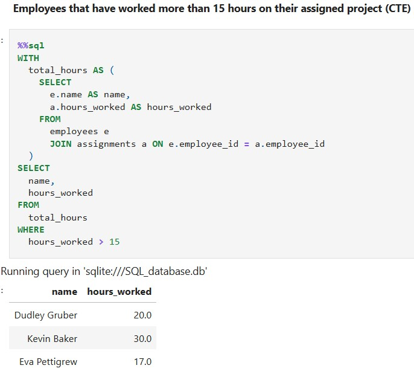
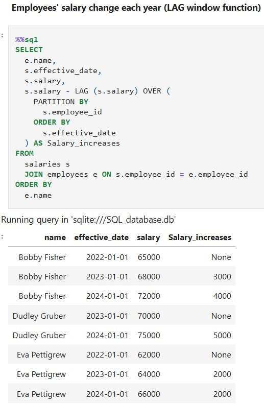

# SQL_Mastery
This project aims to encompass most core tasks in SQL for data analysis. 

## Quick Links
- Jupyter notebook with SQL queries: [Notebook](SQL_Mastery.ipynb)
- Other projects I have made: [Portfolio Website](https://lucashoffschmidt.github.io/)

## Technologies Used
- **JupyterLab**: For running and documenting SQL queries. 
- **SQLite3**: Used to make a local relational database.
- **JupySQL**: Used to write inline SQL queries.
- **SQL**: Used to create database queries. 

## Process
  - Installed and loaded jupysql and connected to the local sqlite database.
  - Created tables for departments, employees, projects, assignments and salaries.

  - Inserted data into the tables.

  - Investigated employees using queries

